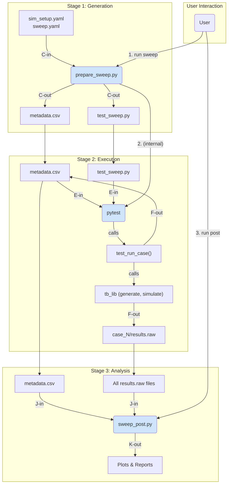

# Simulation Workflow Architecture

## 1. Core Principles

The simulation workflow is built on three core principles to ensure it is robust, flexible, and maintainable.

-   **Pytest as the Orchestrator**: Instead of building a custom scheduler, we leverage the mature, battle-tested `pytest` framework. This gives us powerful features like test discovery, parameterization, parallel execution (`pytest-xdist`), and rich reporting for free.
-   **Configuration-Driven**: The entire workflow is driven by explicit configuration files (`sim_setup.yaml` and sweep definitions). This eliminates "magic" directory structures and makes the simulation suite transparent and easy to understand.
-   **Separation of Concerns**: The workflow is divided into three distinct, independent stages: Generation, Execution, and Analysis. Each stage has a single responsibility and communicates with the others through well-defined data artifacts.

## 2. The Three-Stage Architecture

The "orchestrator" is not a single script but a system of three specialized components.

### Stage 1: The Generator (`prepare_sweep.py`)

This script is the user's entry point for kicking off a new sweep. Its sole responsibility is to translate the user's high-level intent into a concrete, executable test plan.

-   **Inputs**: `sim_setup.yaml` and a specific sweep definition YAML.
-   **Process**:
    1.  Calculates the Cartesian product of all parameters specified in the sweep file.
    2.  Creates the master output directory for the sweep.
    3.  Generates the `metadata.csv` file, which contains a unique row for every simulation case (`case_id`, parameters, status, result_path, etc.). This file is the "source of truth" for the entire sweep.
    4.  Dynamically generates a Python test file (e.g., `test_pvt_dc.py`) containing the `pytest` test functions needed to execute the plan.
-   **Outputs**: A `metadata.csv` file and a `test_*.py` file.

### Stage 2: The Executor (`pytest`)

This is the engine of the workflow. It discovers and runs the test plan created by the Generator.

-   **Inputs**: The `test_*.py` file generated in the previous stage.
-   **Process**:
    1.  A user-facing wrapper script (e.g., `run.py`) invokes `pytest` on the generated test file.
    2.  The test file uses `pytest`'s parameterization features to create a unique test for each row in the `metadata.csv`.
    3.  Each test function executes a single simulation case: it calls the core library functions (`tb_lib`) to generate a netlist and run `ngspice`.
    4.  Upon completion, it updates the status of its corresponding case in the `metadata.csv`.
-   **Outputs**: Raw simulation data (`results.raw`) for each case and a `metadata.csv` with updated status fields.

### Stage 3: The Analyzer (`sweep_post.py`)

This is the final stage for interpreting and visualizing the results of the entire sweep.

-   **Inputs**: The path to the sweep's output directory, which contains the `metadata.csv` and all the raw results.
-   **Process**: It uses the `metadata.csv` as a map to load, process, and aggregate data from all the individual simulation runs.
-   **Outputs**: High-level summary plots (e.g., "Gain vs. Vdda"), HTML reports, and extracted performance metrics.

## 3. Workflow Diagram & Boundaries



-   **Boundary (Gen -> Exec)**: The `metadata.csv` and `test_*.py` files. The generator is stateless and its job is done once these are created.
-   **Boundary (Exec -> Analysis)**: The complete set of `results.raw` files and the fully populated `metadata.csv`. The executor knows how to run one simulation; the analyzer knows how to interpret many. 

# Configuration System

The entire simulation workflow is controlled by a set of human-readable YAML files. This approach ensures that the configuration is explicit, transparent, and version-controllable.

## `sim_setup.yaml`: The Central Hub

The `sim_setup.yaml` file is the main entry point for a given Device Under Test (DUT). It acts as a "control panel," declaring pointers to all the necessary assets for that DUT's simulation environment.

### Key Sections:
-   **`dut`**: Specifies the path to the DUT's schematic or netlist. This is the component that will be tested.
-   **`testbenches`**: A dictionary that declares all available single-run testbenches. The key is a short, user-friendly name (e.g., `dc`), and the value is the relative path to the directory containing that testbench's configuration (`config.yaml`) and template (`template.j2`).
-   **`sweeps`**: A dictionary that declares all available parameter sweeps. The key is the name of the sweep (e.g., `pvt_dc`), and the value is the relative path to the YAML file that defines the sweep's parameters.

### Example:
```yaml
# sim_setup.yaml
dut:
  schematic: /foss/designs/libs/core_analog/ota_5t/ota_5t.sch
  netlist: ./netlists/ota_5t_ac.spice

testbenches:
  dc: ./testbenches/dc
  ac: ./testbenches/ac

sweeps:
  pvt_dc: ./sweeps/pvt/sweep_pvt_dc.yaml
  vdda_sweep: ./sweeps/vdda_sweep.yaml
```

**Important**: All relative paths within this file are resolved relative to the directory containing `sim_setup.yaml` itself.

## Sweep Definition Files

While `sim_setup.yaml` points to the *existence* of a sweep, the sweep definition file specifies *what* to sweep.

### Key Sections:
-   **`testbench`**: A mandatory string that specifies which testbench from `sim_setup.yaml` to use as the base for this sweep (e.g., `dc`).
-   **`parameters`**: A dictionary where each key is a parameter to be swept and the value is a list of values for that parameter. The generator script will compute the Cartesian product of all these lists to create the individual simulation cases.

### Example:
```yaml
# sweeps/pvt_dc.yaml
testbench: dc
parameters:
  vdda: [3.0, 3.3, 3.6]
  temp: [-40, 25, 125]
  model_corner: ["ff", "ss", "tt"]
```

**Note on Parameter Overriding**: The parameters defined in the sweep file are treated as **overrides** to the default values found in the base testbench's `config.yaml`. Any parameter not specified in the sweep file will retain its default value from the `config.yaml`. It is therefore a requirement that any parameter being swept must already exist in the base `config.yaml`.

This separation of concerns—using one file to define the environment and another to define the experiment—is key to the system's flexibility.

## Testbench Configuration

Each directory referenced in the `testbenches` section of `sim_setup.yaml` acts as a self-contained testbench. At its core, a testbench consists of a schematic (`.sch` file) created in a tool like `xschem`, which defines the test setup.

### From Schematic to Template
A key feature of the workflow is the ability to embed Jinja2 placeholders (e.g., `{{ parameters.vdda }}`) directly within the schematic. The simulation netlist is generated from this schematic. This netlist, with the Jinja2 placeholders preserved, becomes the **template netlist** for the testbench. This process allows a single, readable schematic to serve as the source of truth for a configurable netlist.

### Testbench `config.yaml`
Each testbench directory must contain a `config.yaml` file that orchestrates its behavior. It contains:
-   **`schematic`**: The path to the source schematic file.
-   **`template`**: The path to the generated template netlist.
-   **`parameters`**: Default values for all parameters used in the template (e.g., `vdda`, `corner`).
-   Other metadata needed for post-processing, like plot specifications.

### Example: `testbenches/dc/config.yaml`
```yaml
# Points to the source schematic and the target template
schematic: ./tb_dc.sch
template: ./tb_dc.spice.j2

# Default parameters for a DC operating point simulation
parameters:
  vdda: 3.3
  vin_dc: 1.5
  i_bias: 5e-05
  corner: typical

plot_specs:
  dc_tf: ./plots/dc_tf.yaml
```

## Configuration Validation

To prevent common errors from typos or incorrect data types in the YAML configuration files, the system will use `pydantic`.

-   **Schema Enforcement**: For each type of configuration file (`sim_setup.yaml`, sweep definitions, and `config.yaml`), a corresponding `pydantic` model will be defined in the core library.
-   **Early Failure**: Before any processing occurs, `simorc` will load the YAML files and parse them using these models. If there are any validation errors (e.g., a missing required field, a string where a number is expected), the tool will exit immediately with a clear, user-friendly error message indicating the exact location of the problem. This enforces configuration correctness and provides a better user experience.

# Implementation Details

To ensure the architecture is robust and scalable, several key implementation details have been defined.

## `metadata.csv` Schema

The `metadata.csv` file is a critical artifact that acts as a contract between the workflow stages. It will have the following well-defined columns:

-   `case_id`: A unique integer (e.g., 0, 1, 2...) identifying each simulation case.
-   `status`: The current state of the case (`pending`, `in_progress`, `completed`, `failed`).
-   `result_path`: The relative path from the sweep's root to the directory where this case's results and logs are stored (e.g., `results/0/`).
-   One column for each swept parameter (e.g., `vdda`, `temp`, `model_corner`).
-   `error_message`: A column to store the exception message if the case fails, aiding in debugging.

## Resumability and State Management

Sweeps can be time-consuming, and failures are expected. The workflow is designed to be resumable to avoid re-running completed work.

-   **Generator (`prepare_sweep.py`)**: This script will include a `--force` flag. By default, it will refuse to overwrite an existing sweep directory. The `--force` flag allows a user to consciously start a fresh run, deleting previous results.
-   **Executor (`run.py`)**: The executor will be state-aware. Before invoking `pytest`, it will read the `metadata.csv` and dynamically instruct `pytest` to only execute tests for cases whose status is `pending` or `failed`. This provides seamless, automatic resumability.

## Concurrency and Safe State Updates

Running simulations in parallel with `pytest-xdist` introduces the risk of race conditions if multiple processes attempt to write to the master `metadata.csv` simultaneously. This will be avoided using a "scatter-gather" approach.

1.  **Scatter (During Execution)**: Instead of modifying the master `metadata.csv` directly, each `pytest` test worker will, upon completion of a case, write a small, unique JSON status file to a dedicated `.status/` subdirectory (e.g., `sweep_run_1/.status/case_42.json`). This action is atomic and avoids all file contention.
2.  **Gather (Post-Execution)**: After the `pytest` session concludes, the `run.py` wrapper script will perform a final consolidation step. It will read all the individual status files from the `.status/` directory and safely update the master `metadata.csv` in a single, atomic operation.

# Command-Line Interface (`simorc`)

To provide a clean, professional, and intuitive user experience, the entire workflow will be managed by a single command-line tool named `simorc`. This tool will use subcommands that map directly to the architectural stages, providing a clear and discoverable interface.

The main entry point will be a `sim_setup.yaml` file, which `simorc` will use to find all necessary configurations.

## `simorc init`
-   **Purpose**: Scaffolds a new simulation environment.
-   **Action**: Creates a boilerplate `sim_setup.yaml` file and a default directory structure (e.g., `testbenches/`, `sweeps/`, `simulations/`, `netlists/`). This gives users a starting point that they are free to modify.

## `simorc build <sweep_name>`
-   **Purpose**: Prepares a sweep for execution (Stage 1: Generation).
-   **Action**:
    1.  Reads `sim_setup.yaml` to find the path to the `<sweep_name>` definition file.
    2.  Creates a unique, timestamped output directory for the run (e.g., `simulations/pvt_dc_20240101123000/`).
    3.  Generates the `metadata.csv` and `test_pvt_dc.py` files within that directory.
    4.  The path to this output directory becomes the `sweep_run_id` for the subsequent commands.

## `simorc netlist [target]`
-   **Purpose**: Manages the netlist generation for all schematic-based assets (DUT and testbenches). It checks if schematic files are newer than their corresponding netlist files and provides a way to update them.
-   **Action**:
    1.  The command reads `sim_setup.yaml` to identify all schematic-to-netlist relationships. This includes the main `dut` entry and each entry in `testbenches`.
    2.  It then compares the file modification times for each schematic/netlist pair.
-   **Arguments**:
    -   If no `target` is provided, it checks the DUT and *all* testbenches, reporting the status of each.
    -   If `target` is a `<testbench_name>`, it checks only that specific testbench.
    -   If `target` is the special keyword `dut`, it checks only the DUT's netlist.
    -   An `--update` flag can be used to automatically run the netlister to regenerate any stale netlists that are found.
-   **Use Case**: This command should be run whenever a schematic is modified to ensure that subsequent `simorc build` commands use the latest version. It provides a centralized way to keep all simulation assets synchronized.

## `simorc run <sweep_run_id>`
-   **Purpose**: Executes a prepared sweep (Stage 2: Execution).
-   **Action**:
    1.  Locates the specified `sweep_run_id` directory.
    2.  Reads the `metadata.csv` to identify which cases need to be run (`pending` or `failed`).
    3.  Invokes `pytest` on the `test_*.py` file found within the directory.
    4.  After `pytest` completes, it performs the "gather" step to consolidate all status updates into the master `metadata.csv`.

## `simorc plot <sweep_run_id>`
-   **Purpose**: Analyzes and visualizes the results of a completed sweep (Stage 3: Analysis).
-   **Action**:
    1.  Locates the specified `sweep_run_id` directory.
    2.  Reads the sweep definition YAML to find the plotting specifications.
    3.  Launches the analysis script, which uses the `metadata.csv` to load results and generate the defined plots.

## `simorc status`
-   **Purpose**: Provides a real-time progress overview of active and past sweeps.
-   **Action**: Scans the `simulations/` directory, reads the `metadata.csv` for each `sweep_run_id`, and prints a summary table showing progress (e.g., `pvt_dc_run1: 527/1000 completed (52.7%)`).

## `simorc clean [sweep_run_id]`
-   **Purpose**: Removes generated simulation files to free up space.
-   **Action**: 
    -   If a `sweep_run_id` is provided, it will delete that specific run directory.
    -   If no `sweep_run_id` is specified, it will interactively prompt the user to select which of the completed runs from the `simulations/` directory they wish to delete.
    -   A `--all` flag can be used to non-interactively delete all existing simulation runs.
