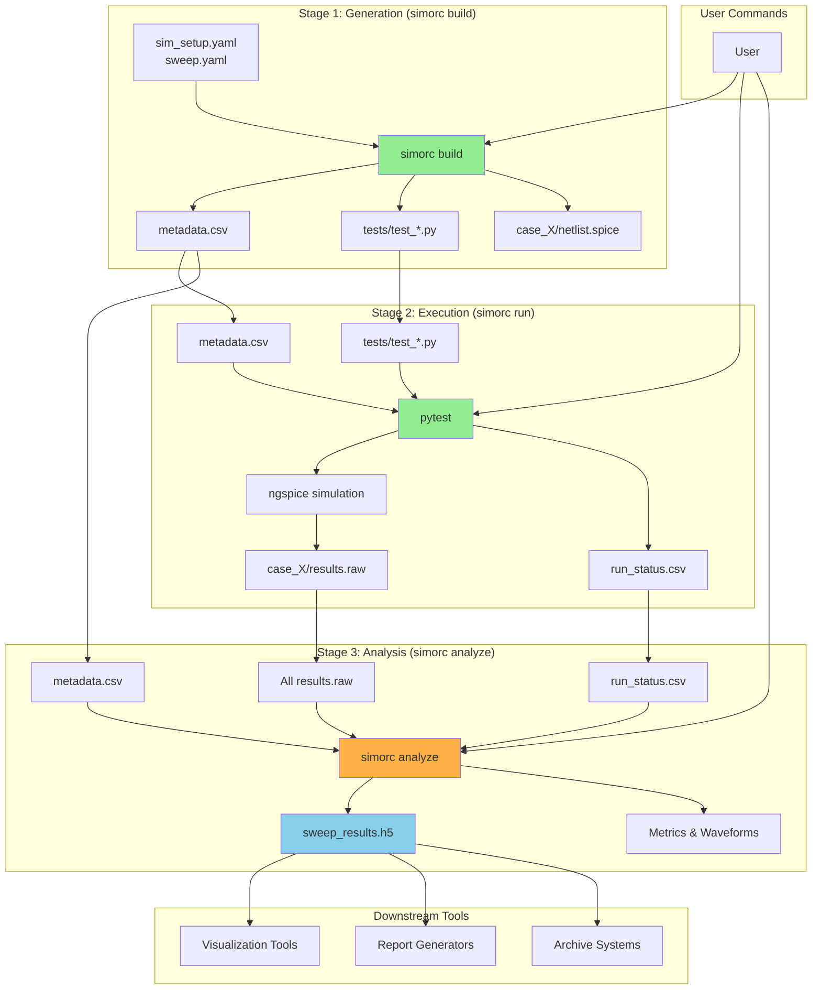

# Simulation Workflow Architecture

## 1. Core Principles

The simulation workflow is built on three core principles to ensure it is robust, flexible, and maintainable.

-   **Pytest as the Orchestrator**: We leverage the mature, battle-tested `pytest` framework for test execution, parameterization, parallel execution (`pytest-xdist`), and rich reporting. This eliminates the need for custom scheduling logic.
-   **Configuration-Driven**: The entire workflow is driven by explicit YAML configuration files (`sim_setup.yaml`, sweep definitions, and testbench configs). This eliminates "magic" directory structures and makes the simulation suite transparent and version-controllable.
-   **Separation of Concerns**: The workflow is divided into three distinct, independent stages: Generation, Execution, and Analysis. Each stage has a single responsibility and communicates through well-defined data artifacts.
-   **Self-Contained Architecture**: simorc includes native SPICE raw file parsing and structured result aggregation, eliminating dependencies on external visualization tools for core functionality.

## 2. The Three-Stage Architecture

The "orchestrator" is not a single script but a system of three specialized components.

### Stage 1: The Generator (`simorc build`)

**Implementation Status**: ✅ **COMPLETE** - Fully implemented and tested

The generator translates user-defined parameter sweeps into concrete, executable test plans.

-   **Command**: `simorc build <sweep_name> [--force] [--directory]`
-   **Inputs**: `sim_setup.yaml` and sweep definition YAML files
-   **Process**:
    1.  **Parameter Expansion**: Calculates the Cartesian product of all parameters specified in the sweep file
    2.  **Directory Structure**: Creates organized `case_X/` directories for each parameter combination
    3.  **Metadata Generation**: Creates `metadata.csv` with case tracking (case_id, parameters, result_file)
    4.  **Netlist Generation**: Uses Jinja2 templates to render parameterized netlists for each case
    5.  **Test Generation**: Creates parametrized `test_*.py` files that read from metadata.csv
-   **Outputs**: 
    - `metadata.csv` (single source of truth)
    - `tests/test_*.py` (pytest-compatible test files)
    - `case_X/netlist.spice` (individual netlists)
    - Organized directory structure for execution

-   **Key Features**:
    - **Template-based**: Jinja2 templating for netlist and test generation
    - **Resumable**: `--force` flag for clean rebuilds
    - **Organized**: Each case gets its own directory
    - **Validated**: Full Pydantic validation of configurations

### Stage 2: The Executor (`simorc run`)

**Implementation Status**: ✅ **COMPLETE** - Fully implemented and tested

The executor runs all simulation cases in a sweep using pytest orchestration.

-   **Command**: `simorc run <sweep_run_id> [-j PARALLEL]`
-   **Inputs**: Generated test files and metadata from Stage 1
-   **Process**:
    1.  **Sweep Discovery**: Intelligently locates sweep directories by name or path
    2.  **Status Initialization**: Creates `run_status.csv` for execution tracking
    3.  **Pytest Execution**: Invokes pytest with optional parallel execution (`-j` flag)
    4.  **Simulation Execution**: Each test case runs ngspice and captures results
    5.  **Status Consolidation**: Aggregates individual case status into summary CSV
-   **Outputs**: 
    - `case_X/case_X_results.raw` (SPICE simulation results)
    - `run_status.csv` (execution status with timing and parameters)
    - `case_X/run_status.json` (individual case status)
    - Comprehensive error logging and debugging info

-   **Key Features**:
    - **Parallel Execution**: pytest-xdist support for multi-process simulation
    - **Status Tracking**: Real-time progress monitoring with timestamps
    - **Error Handling**: Robust failure detection and debugging support
    - **Resumable**: Can restart failed or incomplete sweeps
    - **Live Progress**: Real-time console output during execution
    - **Timing Metrics**: Execution duration tracking per case

### Stage 3: The Analyzer (`simorc analyze`)

**Implementation Status**: 🚧 **PLANNED** - Architecture designed, implementation pending

The analyzer extracts metrics and aggregates results from completed sweep simulations.

-   **Command**: `simorc analyze <sweep_run_id> [--output results.h5]`
-   **Inputs**: SPICE raw files and metadata from completed sweep execution
-   **Process**:
    1.  **Raw File Parsing**: Native SPICE raw file parsing using `spicelib` or `ltspice`
    2.  **Metrics Extraction**: User-defined Python scripts calculate scalar metrics (bandwidth, gain, etc.)
    3.  **Waveform Processing**: Extract and process waveforms (FFT, filtering, derived signals)
    4.  **Data Aggregation**: Combine all results into structured HDF5 format
    5.  **Summary Generation**: Create aggregate statistics and pass/fail matrices
-   **Outputs**:
    - `sweep_results.h5` (structured HDF5 with all data and metadata)
    - Scalar metrics per case (bandwidth, gain, phase margin)
    - Processed waveforms (frequency response, transients, noise)
    - Aggregated sweep statistics and parameter correlations

-   **Key Features**:
    - **Self-Contained**: Native raw file parsing, no external tool dependencies
    - **User-Extensible**: Custom metrics via Python scripts
    - **Structured Output**: HDF5 format with hierarchical data organization
    - **Rich Metadata**: Full configuration and parameter tracking
    - **Tool Agnostic**: Clear contract for downstream visualization/reporting tools

### Planned Analyzer Architecture

#### HDF5 Data Schema
```
sweep_results.h5
├── /metadata/              # Sweep configuration and execution info
├── /cases/case_N/          # Individual case results
│   ├── /scalars/           # Extracted metrics (bandwidth, gain, etc.)
│   ├── /waveforms/         # Processed signals (freq response, etc.)
│   └── attributes          # Case parameters and status
└── /aggregated/            # Cross-case analysis and summaries
```

#### Metrics Configuration
```yaml
# testbench/config.yaml
metrics:
  bandwidth_3db:
    script: "./metrics/bandwidth_3db.py"
    signals: ["frequency", "v(vout)"]
    target: 10e6
    tolerance: 0.1
```

#### Tool Integration Contract
The HDF5 output serves as a standardized interface for downstream tools:
- **Visualization**: Any tool can read HDF5 for plotting (waveview, matplotlib, etc.)
- **Reporting**: Automated report generation from structured data
- **Archival**: Single-file storage of complete sweep results with metadata

## 3. Workflow Diagram & Boundaries



### Stage Boundaries & Contracts

-   **Generation → Execution**: 
    - `metadata.csv` (parameter combinations and case tracking)
    - `tests/test_*.py` (pytest-compatible test files)
    - `case_X/netlist.spice` (parameterized simulation netlists)

-   **Execution → Analysis**: 
    - `case_X/results.raw` (SPICE simulation output files)
    - `run_status.csv` (execution status with timing and parameters)
    - `metadata.csv` (updated with result file paths)

-   **Analysis → Downstream**: 
    - `sweep_results.h5` (structured HDF5 with all data and metadata)
    - Standardized schema for tool-agnostic consumption 

# Configuration System

The entire simulation workflow is controlled by a set of human-readable YAML files. This approach ensures that the configuration is explicit, transparent, and version-controllable.

## `sim_setup.yaml`: The Central Hub

The `sim_setup.yaml` file is the main entry point for a given Device Under Test (DUT). It acts as a "control panel," declaring pointers to all the necessary assets for that DUT's simulation environment.

### Key Sections:
-   **`dut`**: Specifies the path to the DUT's schematic or netlist. This is the component that will be tested.
-   **`testbenches`**: A dictionary that declares all available single-run testbenches. The key is a short, user-friendly name (e.g., `dc`), and the value is the relative path to the directory containing that testbench's configuration (`config.yaml`) and template (`template.j2`).
-   **`sweeps`**: A dictionary that declares all available parameter sweeps. The key is the name of the sweep (e.g., `pvt_dc`), and the value is the relative path to the YAML file that defines the sweep's parameters.

### Example:
```yaml
# sim_setup.yaml
dut:
  schematic: /foss/designs/libs/core_analog/ota_5t/ota_5t.sch
  netlist: ./netlists/ota_5t_ac.spice

testbenches:
  dc: ./testbenches/dc
  ac: ./testbenches/ac

sweeps:
  pvt_dc: ./sweeps/pvt/sweep_pvt_dc.yaml
  vdda_sweep: ./sweeps/vdda_sweep.yaml
```

**Important**: All relative paths within this file are resolved relative to the directory containing `sim_setup.yaml` itself.

## Sweep Definition Files

While `sim_setup.yaml` points to the *existence* of a sweep, the sweep definition file specifies *what* to sweep.

### Key Sections:
-   **`testbench`**: A mandatory string that specifies which testbench from `sim_setup.yaml` to use as the base for this sweep (e.g., `dc`).
-   **`parameters`**: A dictionary where each key is a parameter to be swept and the value is a list of values for that parameter. The generator script will compute the Cartesian product of all these lists to create the individual simulation cases.

### Example:
```yaml
# sweeps/pvt_dc.yaml
testbench: dc
parameters:
  vdda: [3.0, 3.3, 3.6]
  temp: [-40, 25, 125]
  model_corner: ["ff", "ss", "tt"]
```

**Note on Parameter Overriding**: The parameters defined in the sweep file are treated as **overrides** to the default values found in the base testbench's `config.yaml`. Any parameter not specified in the sweep file will retain its default value from the `config.yaml`. It is therefore a requirement that any parameter being swept must already exist in the base `config.yaml`.

This separation of concerns—using one file to define the environment and another to define the experiment—is key to the system's flexibility.

## Testbench Configuration

Each directory referenced in the `testbenches` section of `sim_setup.yaml` acts as a self-contained testbench. At its core, a testbench consists of a schematic (`.sch` file) created in a tool like `xschem`, which defines the test setup.

### From Schematic to Template
A key feature of the workflow is the ability to embed Jinja2 placeholders (e.g., `{{ parameters.vdda }}`) directly within the schematic. The simulation netlist is generated from this schematic. This netlist, with the Jinja2 placeholders preserved, becomes the **template netlist** for the testbench. This process allows a single, readable schematic to serve as the source of truth for a configurable netlist.

### Testbench `config.yaml`
Each testbench directory must contain a `config.yaml` file that orchestrates its behavior. It contains:
-   **`schematic`**: The path to the source schematic file.
-   **`template`**: The path to the generated template netlist.
-   **`parameters`**: Default values for all parameters used in the template (e.g., `vdda`, `corner`).
-   Other metadata needed for post-processing, like plot specifications.

### Example: `testbenches/dc/config.yaml`
```yaml
# Points to the source schematic and the target template
schematic: ./tb_dc.sch
template: ./tb_dc.spice.j2

# Default parameters for a DC operating point simulation
parameters:
  vdda: 3.3
  vin_dc: 1.5
  i_bias: 5e-05
  corner: typical

plot_specs:
  dc_tf: ./plots/dc_tf.yaml
```

## Configuration Validation

To prevent common errors from typos or incorrect data types in the YAML configuration files, the system will use `pydantic`.

-   **Schema Enforcement**: For each type of configuration file (`sim_setup.yaml`, sweep definitions, and `config.yaml`), a corresponding `pydantic` model will be defined in the core library.
-   **Early Failure**: Before any processing occurs, `simorc` will load the YAML files and parse them using these models. If there are any validation errors (e.g., a missing required field, a string where a number is expected), the tool will exit immediately with a clear, user-friendly error message indicating the exact location of the problem. This enforces configuration correctness and provides a better user experience.

# Implementation Details

To ensure the architecture is robust and scalable, several key implementation details have been defined.

## Data Artifacts & Schemas

### `metadata.csv` Schema
The `metadata.csv` file acts as the single source of truth for parameter combinations and case tracking:

-   `case_id`: Unique integer identifier (1, 2, 3...)
-   `result_file`: Relative path to the result file (e.g., `case_1/case_1_results.raw`)
-   One column for each swept parameter (e.g., `R`, `C`, `vdda`, `temp`)

**Note**: Status tracking has been moved to `run_status.csv` for better separation of concerns.

### `run_status.csv` Schema  
The `run_status.csv` file tracks execution status and timing:

-   `case_id`: Links to metadata.csv
-   Parameter columns (duplicated for convenience)
-   `status`: Execution state (`pending`, `completed`, `failed`)
-   `timestamp_iso`: ISO timestamp of completion
-   `simulation_duration`: Execution time in seconds
-   `result_file`: Path to result file
-   `error_message`: Error details for failed cases

## Resumability and State Management

**Implementation Status**: ✅ **COMPLETE** 

Sweeps can be time-consuming, and failures are expected. The workflow is designed to be resumable:

-   **Generator (`simorc build`)**: Includes `--force` flag. By default, refuses to overwrite existing sweep directories. The `--force` flag enables clean rebuilds.
-   **Executor (`simorc run`)**: Fully state-aware. Reads existing `run_status.csv` to skip completed cases and only execute pending or failed simulations. Provides seamless resumability with status consolidation after execution.

## Concurrency and Safe State Updates

**Implementation Status**: ✅ **COMPLETE**

Parallel execution with `pytest-xdist` is handled using a "scatter-gather" approach to avoid race conditions:

1.  **Scatter (During Execution)**: Each `pytest` worker writes individual JSON status files to case directories (e.g., `case_X/run_status.json`). This action is atomic and avoids file contention.
2.  **Gather (Post-Execution)**: After `pytest` completion, `simorc run` consolidates all individual status files into the master `run_status.csv` in a single atomic operation.

This approach successfully enables parallel execution while maintaining data integrity.

# Command-Line Interface (`simorc`)

**Implementation Status**: ✅ **COMPLETE** - Professional CLI with all core commands implemented

The entire workflow is managed through the `simorc` command-line tool with subcommands that map directly to architectural stages. The interface is built with Click for professional user experience.

**Current Dependencies**: `click`, `pydantic`, `pyyaml`, `pytest`, `jinja2`

## Implemented Commands

### `simorc init [directory]` ✅
**Status**: Fully implemented and tested
-   **Purpose**: Scaffolds a new simulation environment
-   **Features**: Creates directory structure, template configurations, example testbench and sweep
-   **Output**: Complete project skeleton ready for customization

### `simorc validate [--directory]` ✅  
**Status**: Fully implemented and tested
-   **Purpose**: Validates project configuration files
-   **Features**: Comprehensive Pydantic validation with detailed error reporting
-   **Output**: Configuration validation results with specific error locations

### `simorc build <sweep_name> [--force] [--directory]` ✅
**Status**: Fully implemented and tested
-   **Purpose**: Prepares a sweep for execution (Stage 1: Generation)
-   **Features**: Parameter expansion, Jinja2 templating, organized case directories
-   **Output**: `metadata.csv`, `tests/test_*.py`, `case_X/netlist.spice`

### `simorc run <sweep_run_id> [-j PARALLEL]` ✅
**Status**: Fully implemented and tested  
-   **Purpose**: Executes a prepared sweep (Stage 2: Execution)
-   **Features**: Parallel execution, status tracking, resumability, real-time progress
-   **Output**: `case_X/results.raw`, `run_status.csv`, execution timing

## Planned Commands

### `simorc analyze <sweep_run_id> [--output results.h5]` 🚧
**Status**: Architecture designed, implementation pending
-   **Purpose**: Extract metrics and aggregate results (Stage 3: Analysis)  
-   **Features**: Raw file parsing, user-defined metrics, HDF5 aggregation
-   **Output**: Structured HDF5 with scalars, waveforms, and metadata

### `simorc status` 📋
**Status**: Placeholder implemented, needs enhancement
-   **Purpose**: Overview of all sweep progress and status
-   **Features**: Multi-sweep dashboard, progress tracking, failure reporting

### `simorc clean [sweep_run_id] [--all]` 📋  
**Status**: Placeholder implemented, needs enhancement
-   **Purpose**: Clean up sweep results to free disk space
-   **Features**: Interactive cleanup, selective deletion, safety checks

## Future Considerations

### `simorc plot <sweep_run_id>` (Optional)
**Status**: Under discussion - may be handled by external tools
-   **Purpose**: Convenience wrapper for visualization  
-   **Note**: May delegate to external tools via HDF5 contract
