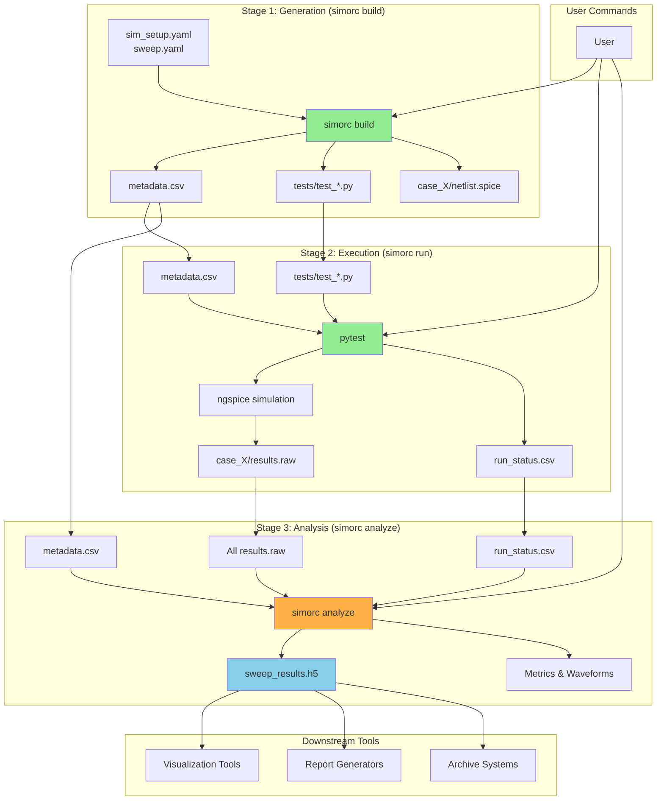

# Workflow Diagram & Boundaries

## Architecture Overview

## Stage Boundaries & Contracts

### Generation → Execution

- **`metadata.csv`**: Parameter combinations and case tracking
- **`tests/test_*.py`**: pytest-compatible test files
- **`case_X/netlist.spice`**: Parameterized simulation netlists

### Execution → Analysis

- **`case_X/results.raw`**: SPICE simulation output files
- **`run_status.csv`**: Execution status with timing and parameters
- **`metadata.csv`**: Updated with result file paths

### Analysis → Downstream

- **`sweep_results.h5`**: Structured HDF5 with all data and metadata
- **Standardized schema**: For tool-agnostic consumption

## Data Flow

The workflow ensures clean data flow between stages:

1. **Stage 1** creates all the configuration and test infrastructure
2. **Stage 2** executes simulations and tracks status
3. **Stage 3** processes results into structured, queryable format
4. **Downstream tools** consume the structured output for visualization and reporting